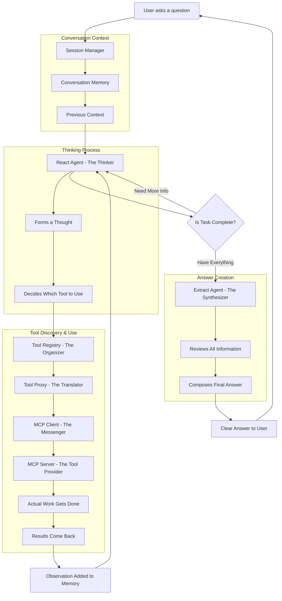

# MCP Server Tools Architecture: A Conceptual Overview

## Executive Summary

This architecture enables an AI agent to discover and use tools dynamically from external servers, rather than having all tools built into the system beforehand. Think of it like a smartphone that can download and use new apps on demand, rather than a calculator with fixed buttons. The system follows a clear pattern: the agent thinks about what to do, selects appropriate tools, uses them to gather information, and then synthesizes everything into a coherent answer.

## The Big Picture: What Makes This Special

### Traditional Approach: Fixed Tools
Imagine a Swiss Army knife where all the tools are permanently attached. You know exactly what tools you have, and they never change. This is how most AI agent systems work - all tools are defined when the system is built.

### Our Approach: Dynamic Tool Discovery
Now imagine a smart workbench that can connect to different tool shops. When you need a specific tool, the workbench discovers what's available, understands how to use it, and creates a handle that lets you work with it seamlessly. This is the MCP (Model Context Protocol) approach - tools are discovered from external servers when needed.

## The Journey of a User Question

Let's follow a user's question through the entire system to understand how everything works together.

## Core Modules

### The Session Manager
Think of this as the project manager for your conversation. It keeps track of who you are, what you've talked about before, and manages the entire interaction from start to finish. When you ask a question, the Session Manager sets everything in motion and ensures all the pieces work together smoothly.

### The Conversation Memory
This is like a smart notebook that remembers your conversation history. It doesn't just store everything word-for-word; it intelligently summarizes older parts of the conversation while keeping recent interactions detailed. This allows the AI to maintain context over long conversations without getting overwhelmed.

### The React Agent (The Thinker)
This is the reasoning brain of the system. When given a task, it:
- Analyzes what information is needed
- Thinks through the problem step by step
- Decides which tool would be most helpful
- Formulates how to use that tool effectively

The React Agent follows a pattern called "React" which stands for Reasoning and Acting. It alternates between thinking about the situation and taking action through tools.

### The Tool Registry (The Organizer)
Imagine a library card catalog that keeps track of all available tools. But unlike a traditional catalog, this one can handle both permanent tools (like books always on the shelf) and temporary tools (like visiting exhibits). When tools are discovered from MCP servers, they're registered here so the system knows they exist and how to access them.

### The Tool Proxy (The Translator)
This is the crucial bridge between two different worlds. MCP servers speak one language (the MCP protocol), while our AI system speaks another (the DSPy framework language). The Tool Proxy acts as a translator, making MCP tools appear and behave exactly like native tools to the rest of the system. It's like having a universal adapter that makes any foreign plug work in your outlets.

### The MCP Client (The Messenger)
This component handles all communication with external MCP servers. It's like a diplomatic courier that:
- Establishes connections with MCP servers
- Asks what tools they have available
- Delivers tool execution requests
- Brings back the results

### The MCP Server (The Tool Provider)
These are external services that provide actual tools. They could be:
- A real estate database that can search properties
- A weather service that provides forecasts
- A calculation engine that solves complex math
- Any service that follows the MCP protocol

The beauty is that these servers can be written in any programming language and run anywhere - they just need to speak the MCP protocol.

### The Extract Agent (The Synthesizer)
After all the information gathering is done, this component takes over. It reviews everything that happened - all the thoughts, all the tool uses, all the results - and synthesizes them into a clear, coherent answer. It's like a skilled editor who takes rough notes and creates a polished article.

## How Tools Come to Life: The Discovery Process

When the system starts up and connects to an MCP server, something magical happens:

1. **Initial Handshake**: The MCP Client introduces itself to the MCP Server
2. **Tool Discovery**: The server shares a catalog of all its available tools, including:
   - What each tool is called
   - What it does
   - What information it needs to work
   - What kind of results it provides

3. **Proxy Creation**: For each discovered tool, the system creates a Tool Proxy that:
   - Understands the tool's requirements
   - Knows how to package requests properly
   - Can translate between the AI system's needs and the tool's expectations
   - Captures a permanent connection to the tool

4. **Registration**: Each proxy is registered in the Tool Registry, making it available for use

## The Thought-to-Action Flow

Let's walk through what happens when the AI needs to use a tool:

### Step 1: The Thought Process
The React Agent receives the user's question along with any relevant conversation history. It thinks: "What do I need to know to answer this question?" This thinking process is explicit and recorded.

### Step 2: Tool Selection
Based on its thought, the React Agent selects the most appropriate tool from those available in the Tool Registry. It also figures out what information to give the tool - like telling a search tool what to look for and where.

### Step 3: The Translation Layer
The Tool Registry finds the right Tool Proxy. The proxy takes the agent's request and translates it into the format the MCP tool expects. This is like translating a request from English into the specific language and format the tool understands.

### Step 4: The Journey to the Server
The MCP Client takes the translated request and sends it to the MCP Server. This communication happens over the network, using standard web protocols.

### Step 5: Tool Execution
The MCP Server receives the request, runs the actual tool (searching a database, calling an API, performing calculations), and sends back the results.

### Step 6: The Return Journey
The results flow back through the MCP Client to the Tool Proxy, which translates them into a format the AI system understands. These results become an "observation" that gets added to the conversation.

### Step 7: The Decision Point
The React Agent sees the observation and decides: "Do I have enough information to answer the user's question, or do I need to use another tool?" This creates a loop where the agent can gather multiple pieces of information before providing an answer.

### Step 8: Final Synthesis
Once the React Agent decides it has enough information (by selecting a special "finish" action), the Extract Agent takes over. It reviews the entire conversation - all the thoughts, tool uses, and observations - and crafts a comprehensive answer.

## The Innovation: Dynamic vs Static Tools

### Why This Matters

**Traditional Static Approach**:
- All tools must be known and built when the system is created
- Adding new tools requires updating and redeploying the entire system
- Tools are tightly coupled with the AI agent code
- Limited flexibility and scalability

**Dynamic MCP Approach**:
- Tools can be added or removed while the system is running
- New capabilities can be provided by connecting to new MCP servers
- Tools can be updated independently without touching the AI system
- Tools can be written in any language and hosted anywhere

### The Closure Pattern: Capturing Context

One of the clever engineering patterns used is called a "closure." Think of it like giving someone a sealed envelope with instructions and all the necessary information inside. When it's time to use a tool, the proxy opens its envelope which contains:
- The connection to the MCP server
- The tool's specific requirements
- How to format requests and responses

This envelope was created when the tool was discovered and stays with the proxy throughout its lifetime.

## Real-World Example: Finding Real Estate

Let's trace through a concrete example to see how all these pieces work together:

**User asks**: "Find modern homes with pools in San Francisco"

**The Session Manager** receives this request and checks the conversation history. This might be a new conversation or part of an ongoing discussion about house hunting.

**The React Agent** thinks: "I need to search for properties with specific criteria in a specific location. I should use a property search tool."

**Tool Selection**: The agent selects "search_properties_tool" from the Tool Registry and prepares the search criteria: location is San Francisco, style is modern, and features include a pool.

**The Tool Proxy** for search_properties_tool takes these criteria and formats them according to what the MCP server expects.

**The MCP Client** sends this request to the real estate MCP server.

**The MCP Server** queries its database and returns a list of matching properties with details like addresses, prices, and features.

**The Results** flow back through the system and become an observation: "Found 5 modern homes with pools in San Francisco, ranging from $2.5M to $5M."

**The React Agent** reviews this observation and thinks: "I have the information needed to answer the user's question. Time to finish."

**The Extract Agent** takes over, reviews everything, and composes the final answer: "I found 5 modern homes with pools in San Francisco. Here are the highlights: ..." followed by a well-organized summary of the properties.

## Session Awareness: Maintaining Context

Throughout this process, the system maintains awareness of:

### User Identity
The system knows who is making the request, allowing for personalized responses and maintaining user-specific context.

### Conversation History
Previous interactions inform current responses. If you previously mentioned you prefer three-bedroom homes, the system remembers this context.

### Session State
The system tracks the current session's progress, what tools have been used, and what information has been gathered.

### Tool Access
Some tools might need to know about the user or session context. The system can provide this information to tools that are marked as "session-aware."

## The Benefits of This Architecture

### Flexibility at Runtime
New capabilities can be added without stopping or modifying the core system. It's like being able to add new apps to your phone without getting a new phone.

### Separation of Concerns
The thinking and reasoning (AI agents) are completely separate from the doing (tools). This means experts can focus on making better AI reasoning while other experts focus on building better tools.

### Language and Platform Independence
MCP servers can be written in any programming language and run on any platform. As long as they speak the MCP protocol, they can provide tools to the system.

### Scalability
Tools can be distributed across many servers, allowing the system to scale horizontally. Heavy computational tools can run on powerful servers while simple tools run locally.

### Observability
Every step of the process is recorded - every thought, every tool use, every observation. This creates a complete audit trail that helps understand how the AI reached its conclusions.

### Resilience
If one MCP server becomes unavailable, the system continues working with the remaining tools. The architecture is designed to handle failures gracefully.

## The Complete Observe-React-Extract Pattern

The system follows a three-phase pattern for every user interaction:

### Phase 1: Observe
The system observes the user's question and any relevant context from previous conversations. This sets the stage for intelligent reasoning.

### Phase 2: React Loop
The system enters a loop where it:
- Thinks about what information is needed
- Selects and uses appropriate tools
- Observes the results
- Decides whether to continue gathering information or finish

This loop can run multiple times, allowing the agent to build up a complete picture through multiple tool uses.

### Phase 3: Extract
Once sufficient information is gathered, the system extracts and synthesizes all observations into a coherent, comprehensive answer that directly addresses the user's question.

## Conclusion

This architecture represents a fundamental shift in how AI agents interact with tools. Instead of being limited to a fixed set of capabilities, the system can dynamically discover and use new tools from external servers. The separation between reasoning (what the AI agents do) and execution (what the tools do) creates a flexible, scalable, and maintainable system.

The use of proxies as translators, the registry as an organizer, and the session as a context manager all work together to create a seamless experience where complex technical operations happen behind the scenes while users simply get their questions answered.

This is not just a technical achievement but a new paradigm for AI systems - one where capabilities can grow and evolve without requiring changes to the core intelligence layer. It's like giving the AI agent not just a fixed set of tools, but the ability to discover and learn to use new tools as they become available.