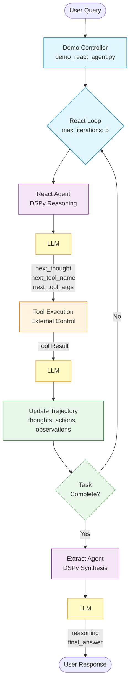
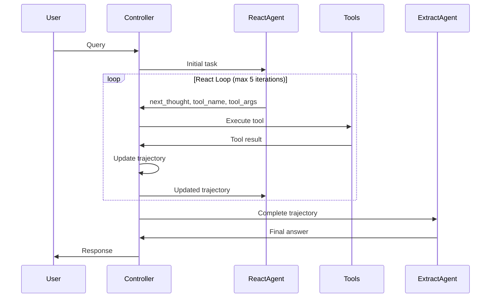
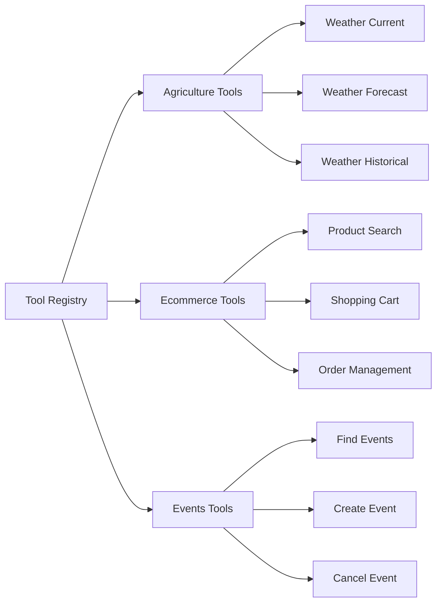

# Agentic Loop Architecture

## React → Extract → Observe Pattern

## Key Components

### 1. Demo Controller (`demo_react_agent.py`)
- Maintains external control over the entire loop
- Manages iteration limits and timeouts
- Handles tool registration and execution

### 2. React Agent (`react_agent.py`)
- Uses `dspy.Predict` for reasoning
- Selects tools based on task and trajectory
- Returns structured output with next action

### 3. Tool Execution
- Controller executes tools externally
- Maintains full error handling and retry logic
- Updates trajectory with observations

### 4. Extract Agent (`extract_agent.py`)
- Uses `dspy.ChainOfThought` for synthesis
- Analyzes complete trajectory
- Produces final answer from all observations

### 5. Trajectory State
- Stores all thoughts, actions, and observations
- Provides full observability of the process
- Used by both React and Extract agents

## Data Flow

## Tool Set Architecture

