# MCP Real Estate Demo System - In-Depth Documentation

## Table of Contents
1. [Overview](#overview)
2. [Architecture](#architecture)
3. [Component Interactions](#component-interactions)
4. [Demo Workflow Details](#demo-workflow-details)
5. [Tool Discovery Process](#tool-discovery-process)
6. [Tool Execution Flow](#tool-execution-flow)
7. [Individual Demo Explanations](#individual-demo-explanations)
8. [Server Communication Protocol](#server-communication-protocol)

## Overview

The MCP (Model Context Protocol) Real Estate Demo System demonstrates a sophisticated integration between a local Python application and a remote MCP server that provides real estate search capabilities. The system showcases dynamic tool discovery, real-time data retrieval, and intelligent property search using AI-powered semantic understanding.

### Key Features
- **Dynamic Tool Discovery**: Tools are not hardcoded but discovered at runtime from the MCP server
- **Real-Time Data**: All property data, Wikipedia articles, and search results come live from the server
- **AI Semantic Search**: Natural language queries are understood through AI embeddings
- **No Mock Data**: Every demo uses actual server responses, no fake or cached data

## Architecture

### High-Level System Architecture

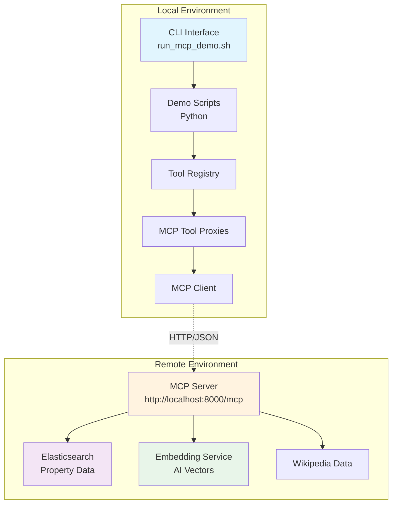

### Component Hierarchy

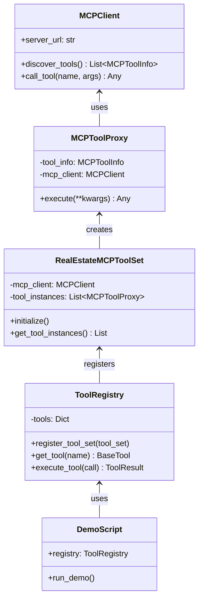

## Component Interactions

### 1. Initialization Flow

When a demo starts, the following initialization sequence occurs:

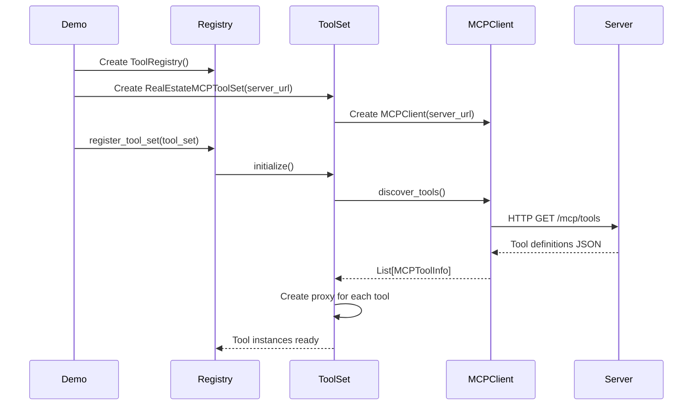

### 2. Tool Discovery Deep Dive

The tool discovery process is fundamental to the system's flexibility:

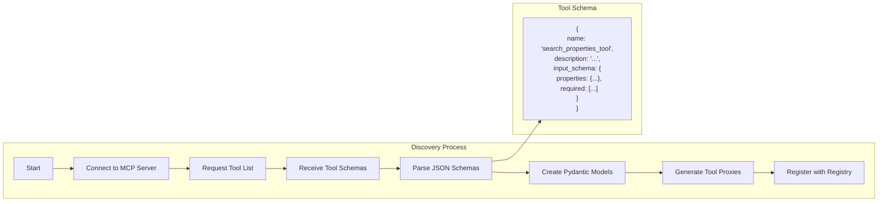

## Demo Workflow Details

### Demo 1: Tool Discovery Demo

**Purpose**: Demonstrates the dynamic discovery of tools from the MCP server.

**Workflow**:

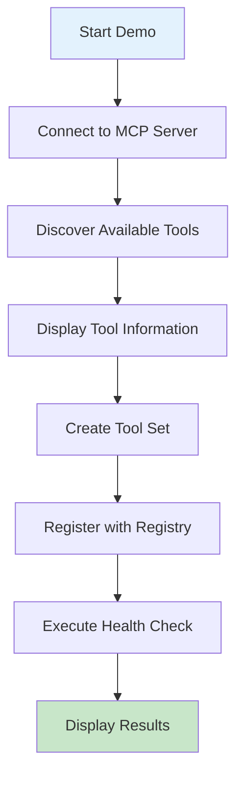

**What Happens**:
1. The demo connects to `http://localhost:8000/mcp`
2. It sends a discovery request to get all available tools
3. For each tool, it displays:
   - Tool name and description
   - Input parameters (required and optional)
   - Parameter types and descriptions
4. Creates proxy instances for each discovered tool
5. Registers all tools with the local registry
6. Performs a live health check to verify connectivity

### Demo 2: Direct Tool Execution Demo

**Purpose**: Shows direct execution of MCP tools through the registry.

**Execution Flow**:

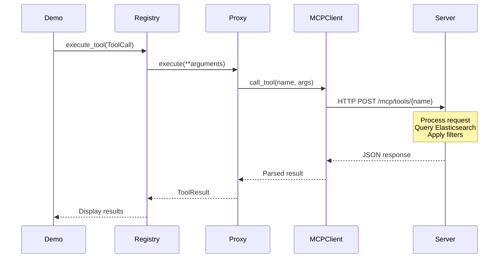

**Examples Executed**:
1. **Property Search**: Searches for "spacious home with modern kitchen"
2. **Wikipedia Location Search**: Researches San Francisco neighborhoods
3. **Natural Language Search**: Finds "cozy cottage with character"
4. **Property Details**: Gets detailed info for specific property
5. **Health Check**: Verifies all system components

### Demo 3: Property Search Demo

**Purpose**: Demonstrates intelligent tool selection based on query type.

**Decision Flow**:

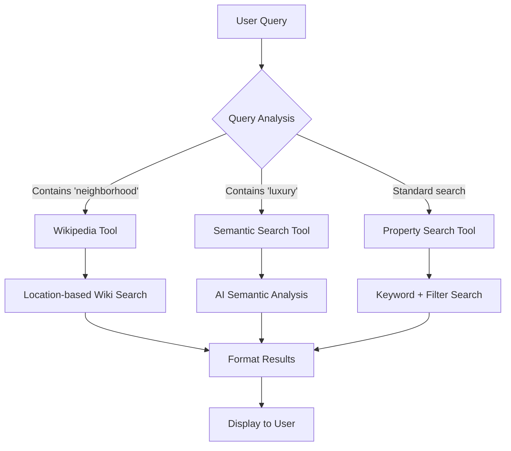

**Query Processing**:
- Analyzes natural language input
- Selects appropriate tool automatically
- Formats results based on tool type
- Provides context-aware responses

### Demo 4: AI Semantic Search Demo

**Purpose**: Showcases AI-powered understanding of natural language queries.

**Semantic Processing**:

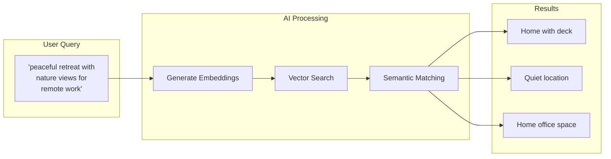

**How It Works**:
1. User provides natural language description
2. Server generates AI embeddings of the query
3. Performs vector similarity search in Elasticsearch
4. Returns properties that semantically match the intent
5. Results include relevance scores

### Demo 5: Location Discovery Demo

**Purpose**: Combines multiple tools for comprehensive location insights.

**Multi-Tool Orchestration**:

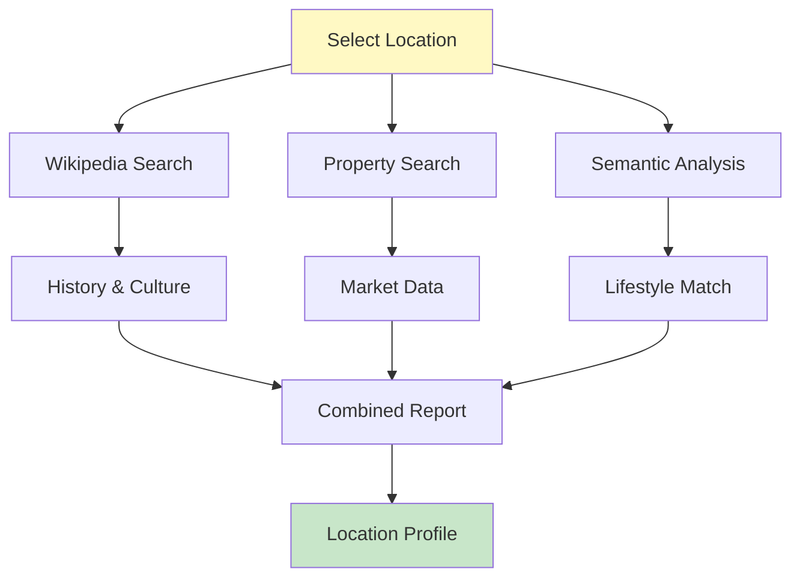

**Information Gathered**:
- Wikipedia articles about the area
- Current property listings
- Market statistics (prices, inventory)
- Neighborhood characteristics
- Family-friendly ratings

### Demo 6: Multi-Tool Orchestration Demo

**Purpose**: Demonstrates complex scenarios requiring coordinated tool usage.

**Orchestration Pattern**:

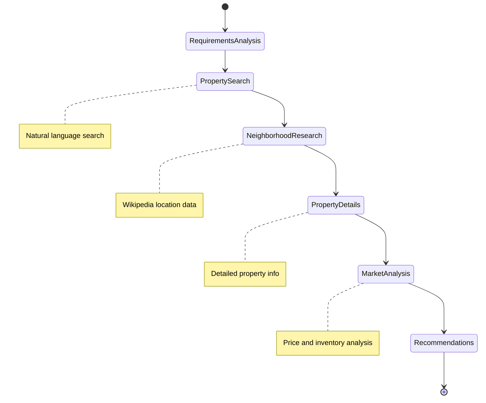

## Tool Discovery Process

### Detailed Discovery Sequence

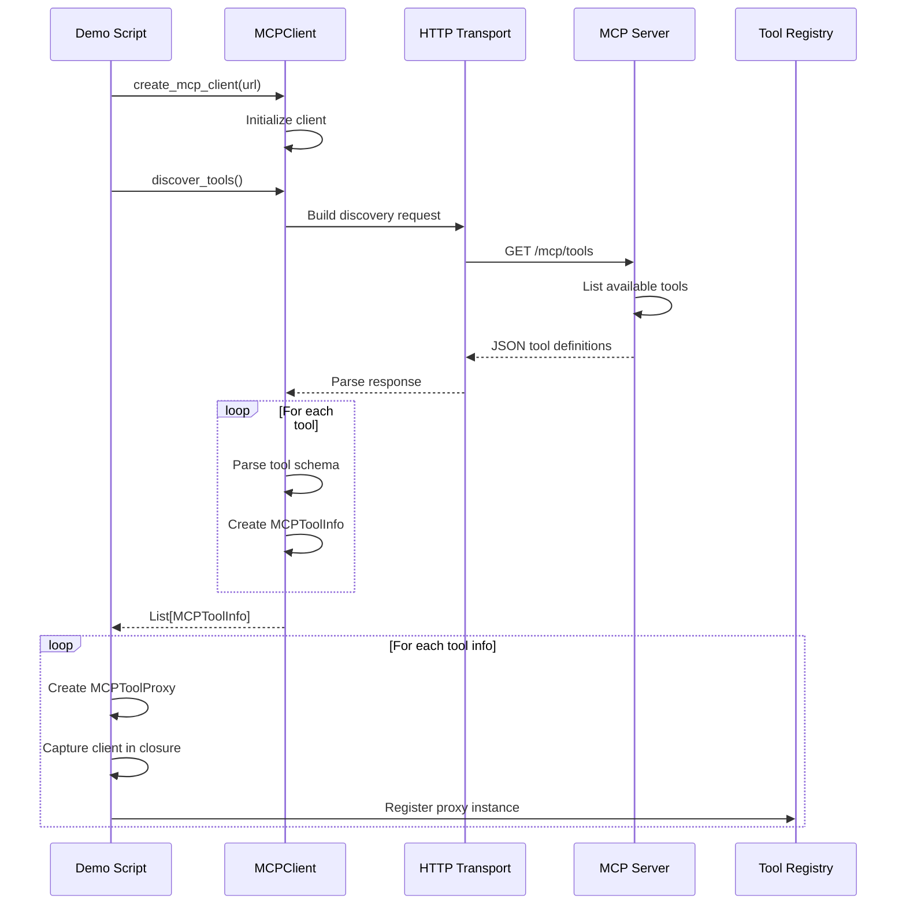

### Tool Schema Structure

Each tool discovered from the server includes:

```json
{
  "name": "search_properties_tool",
  "description": "Search for properties using natural language queries",
  "input_schema": {
    "type": "object",
    "properties": {
      "query": {
        "type": "string",
        "description": "Natural language search query"
      },
      "min_price": {
        "type": "number",
        "description": "Minimum price filter"
      },
      "max_price": {
        "type": "number",
        "description": "Maximum price filter"
      }
    },
    "required": ["query"]
  }
}
```

## Tool Execution Flow

### Execution Pipeline

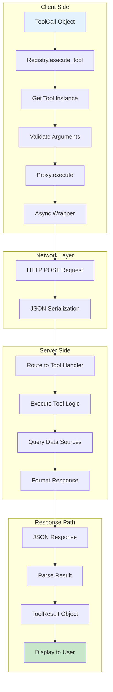

### Error Handling

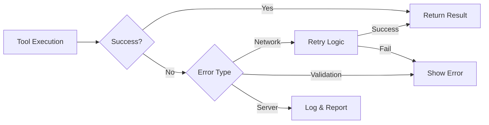

## Individual Demo Explanations

### Demo 1: Tool Discovery (`demo_tool_discovery.py`)

**What It Does**:
This demo connects to the MCP server and discovers all available tools dynamically. It showcases that tools are not hardcoded in the client but are discovered at runtime.

**Key Steps**:
1. **Direct Discovery**: Connects to server and retrieves tool list
2. **Tool Set Integration**: Creates proxy instances for each tool
3. **Registry Integration**: Registers tools for use by other components
4. **Live Verification**: Executes health check to verify connectivity
5. **Display Details**: Shows comprehensive information about each tool

**Real Server Interaction**:
- Sends: `GET http://localhost:8000/mcp/tools`
- Receives: JSON array of tool definitions
- Creates: Dynamic proxy instances with captured client

### Demo 2: Direct Tool Execution (`demo_direct_tools.py`)

**What It Does**:
Demonstrates direct execution of MCP tools through the registry, showing how each tool returns real data from the server.

**Examples Shown**:
1. **Property Search**: 
   - Query: "spacious home with modern kitchen and natural light"
   - Returns: Actual properties from Elasticsearch with prices, locations, descriptions

2. **Neighborhood Research**:
   - Query: "San Francisco neighborhoods culture history"
   - Returns: Wikipedia articles about SF neighborhoods

3. **Natural Language Search**:
   - Query: "cozy cottage with character near parks"
   - Returns: Properties matched using AI semantic understanding

4. **Property Details**:
   - Query: Specific property ID
   - Returns: Complete property information

5. **System Health**:
   - Query: No parameters
   - Returns: Status of all backend services

### Demo 3: Property Search (`demo_property_search.py`)

**What It Does**:
Shows intelligent tool selection based on query content, simulating how an AI agent would choose the right tool.

**Intelligence Layer**:
```python
if "neighborhood" in query or "tell me about" in query:
    # Use Wikipedia tool for area information
elif "luxury" in query or "stunning" in query:
    # Use semantic search for descriptive queries
else:
    # Use standard property search
```

**Query Examples**:
- "Modern family home with pool" → Property Search Tool
- "Tell me about Temescal" → Wikipedia Location Tool
- "Luxury properties with views" → Natural Language Tool

### Demo 4: AI Semantic Search (`demo_semantic_search.py`)

**What It Does**:
Demonstrates the power of AI-powered semantic search that understands intent beyond keywords.

**Semantic Scenarios Tested**:
1. **Lifestyle Match**: "peaceful retreat with nature views"
2. **Entertainment Focus**: "perfect for entertaining friends"
3. **Urban Living**: "near transit and coffee shops"
4. **Family Needs**: "safe neighborhood, good schools"
5. **Investment**: "rental potential in up-and-coming area"
6. **Sustainability**: "eco-friendly with solar panels"
7. **Character Homes**: "historic charm with updates"
8. **Minimalist**: "clean lines, natural light"

**How Semantic Search Works**:
1. Query is converted to embedding vector
2. Vector similarity search in Elasticsearch
3. Returns properties that match the "meaning" not just keywords
4. Includes relevance scores for ranking

### Demo 5: Location Discovery (`demo_location_context.py`)

**What It Does**:
Combines multiple tools to provide comprehensive location insights, showing how tools work together.

**Multi-Tool Approach**:
```python
def explore_location(city, state):
    # Step 1: Wikipedia research
    wiki_results = search_wikipedia_by_location(city, state)
    
    # Step 2: Property inventory
    properties = search_properties(f"homes in {city}")
    
    # Step 3: Neighborhood insights
    insights = natural_language_search(
        f"family-friendly neighborhoods in {city}"
    )
    
    return combined_analysis
```

**Information Provided**:
- Historical and cultural context
- Current real estate market data
- Price statistics and trends
- Neighborhood characteristics
- Family-friendliness ratings

### Demo 6: Multi-Tool Orchestration (`demo_multi_tool.py`)

**What It Does**:
Demonstrates complex real-world scenarios that require multiple tools working in coordination.

**Orchestration Examples**:

1. **Dream Home Search**:
   - Requirements analysis
   - Property search with criteria
   - Neighborhood research
   - Property details retrieval
   - Market analysis
   - Personalized recommendations

2. **Location Comparison**:
   - Multiple city analysis
   - Property availability comparison
   - Price comparisons
   - Wikipedia context for each location

3. **Investment Analysis**:
   - Investment property search
   - Rental market research
   - ROI calculations
   - Market trend analysis

## Server Communication Protocol

### Request Format

All tool executions follow this pattern:

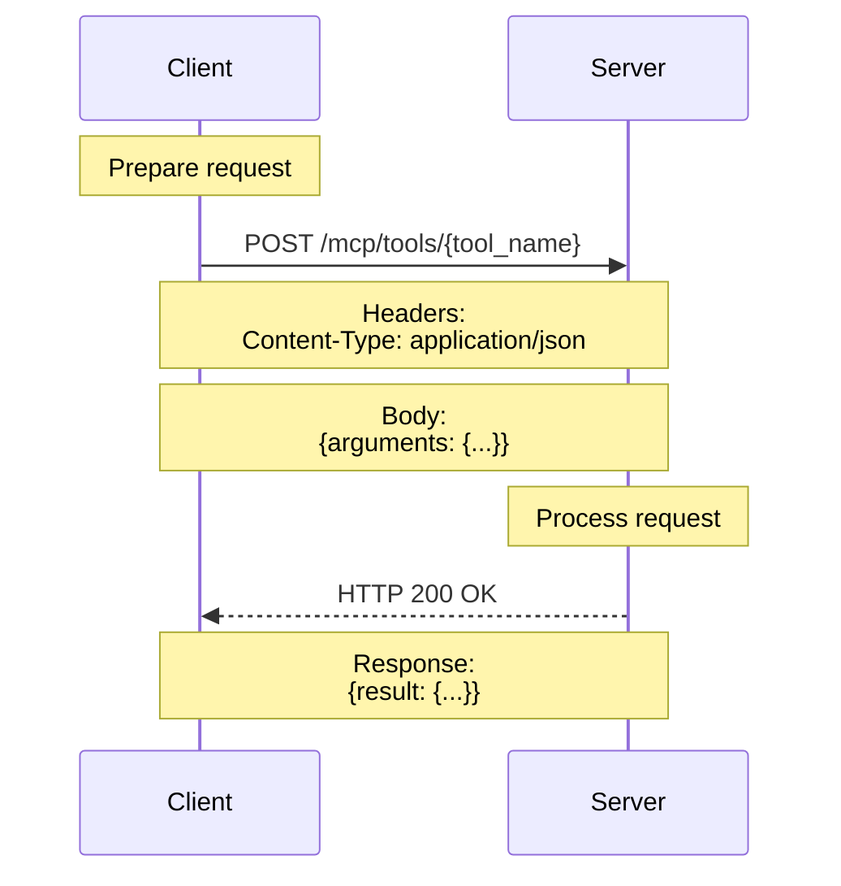

### Request/Response Examples

**Property Search Request**:
```http
POST http://localhost:8000/mcp/tools/search_properties_tool
Content-Type: application/json

{
  "arguments": {
    "query": "modern home with pool",
    "min_price": 500000,
    "max_price": 1000000,
    "size": 5
  }
}
```

**Property Search Response**:
```json
{
  "result": {
    "total_results": 45,
    "properties": [
      {
        "id": "PROP-123",
        "property_type": "Single-Family",
        "price": 750000,
        "bedrooms": 4,
        "bathrooms": 3,
        "square_feet": 2500,
        "address": {
          "street": "123 Oak Street",
          "city": "Oakland",
          "state": "CA",
          "zip_code": "94612"
        },
        "description": "Beautiful modern home..."
      }
    ]
  }
}
```

### Data Flow Architecture

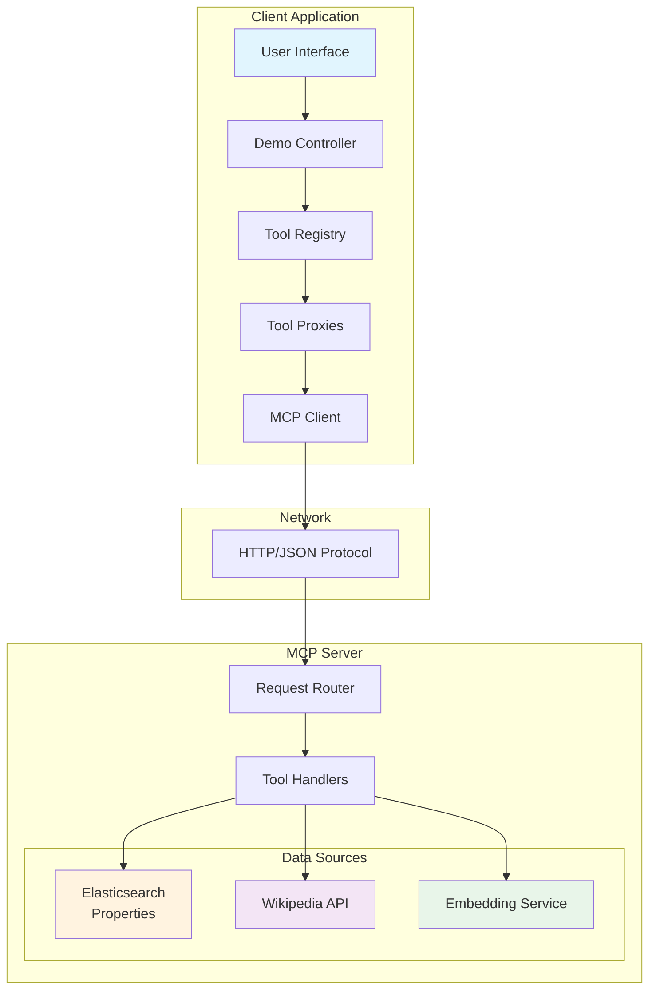

## Key Design Patterns

### 1. Proxy Pattern with Closures

The system uses proxy objects that capture the MCP client in a closure:

```python
class MCPToolProxy:
    def __init__(self, tool_info, mcp_client):
        # Capture client in closure
        async def execute_tool(**kwargs):
            return await mcp_client.call_tool(
                tool_info.name, 
                kwargs
            )
        self._instance_func = execute_tool
```

### 2. Dynamic Model Generation

Pydantic models are created dynamically from JSON schemas:

```python
def create_args_model(schema):
    fields = {}
    for name, spec in schema["properties"].items():
        field_type = map_json_to_python(spec["type"])
        fields[name] = (field_type, Field(...))
    return create_model("DynamicArgs", **fields)
```

### 3. Registry Pattern

All tools are managed through a central registry:

```python
registry = ToolRegistry()
registry.register_tool_set(mcp_tools)
result = registry.execute_tool(tool_call)
```

## Performance Characteristics

### Typical Response Times

- **Tool Discovery**: 50-100ms
- **Property Search**: 200-400ms
- **Semantic Search**: 150-300ms
- **Wikipedia Search**: 300-600ms
- **Health Check**: 20-50ms

### Scaling Considerations

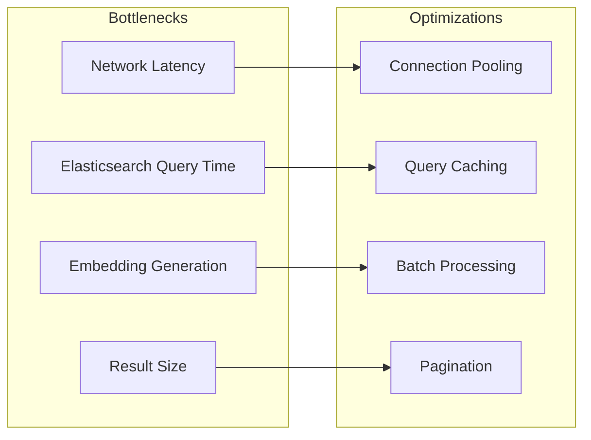

## Summary

The MCP Real Estate Demo System showcases a sophisticated integration pattern where:

1. **Tools are discovered dynamically** from a remote server, not hardcoded
2. **All data is real and live**, fetched from actual databases and services
3. **AI semantic search** provides intelligent understanding of natural language
4. **Multiple tools coordinate** to solve complex real-world scenarios
5. **Clean architecture** separates concerns between discovery, registration, and execution
6. **No mock data** ensures demonstrations show actual system capabilities

The system demonstrates how modern applications can leverage remote AI services while maintaining clean, maintainable code architecture on the client side.