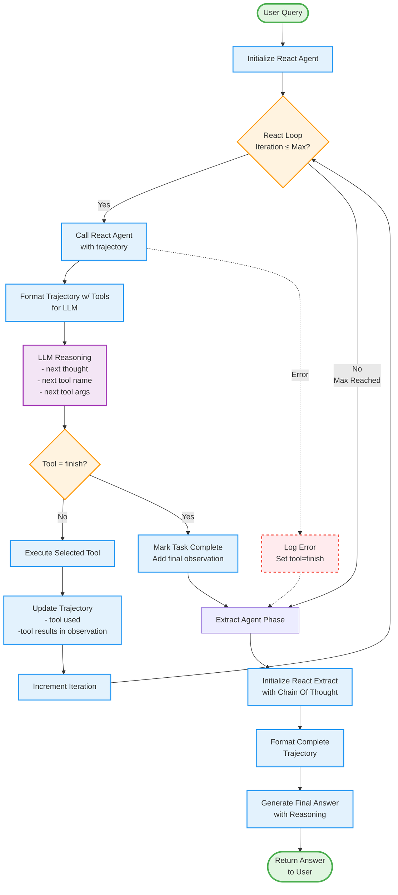

# DSPy Agentic Loop: A React → Act-> Extract Implementation

• DSPy introduces a structured approach to agentic workflows, ensuring clarity and reliability

• This implementation demonstrates a clean React → Extract pattern for tool-based reasoning

## React → Extract Pattern

The agentic loop follows a React (Reason and Act) pattern followed by an Extract phase to synthesize the final answer.

### Key Concepts

• **Trajectory**: A simple in-memory dictionary that stores tool calls and their results as observations throughout the execution

• **React Agent**: Analyzes the trajectory and available tools to decide which tool to execute next

• **Extract Agent**: Takes the complete trajectory of all tool calls and synthesizes them into a coherent final answer

• **Execution Flow**: React Agent → Execute Tool → Store in Trajectory → Repeat until done → Extract Agent formats final results



## Key Components

### 1. **ReactAgent** (`react_agent.py`)
- Implements the React (Reason and Act) pattern
- Manages tool selection and execution loop
- Builds instructions with available tools
- Formats trajectory for LLM consumption
- Returns: (trajectory, tool_name, tool_args)

### 2. **Extract Agent** (`extract_agent.py`)
- Uses ChainOfThought to synthesize final answer
- Processes complete trajectory from React phase
- Extracts meaningful answer from all observations
- Returns: Final answer with reasoning

### 3. **Trajectory Structure**
The trajectory is a dictionary that accumulates state across iterations:
```
{
  "thought_0": "First reasoning step",
  "tool_name_0": "search_events",
  "tool_args_0": {"location": "Tokyo"},
  "observation_0": "Found 3 events...",
  "thought_1": "Need more details...",
  "tool_name_1": "get_event_details",
  "tool_args_1": {"event_id": "123"},
  "observation_1": "Event details...",
  ...
}
```

### 4. **Tool Execution Flow**
1. ReactAgent selects tool based on current trajectory
2. Tool is executed via ToolRegistry
3. Result stored as observation
4. Process repeats until "finish" or max iterations

### 5. **Extract Phase**
1. Complete trajectory passed to ExtractAgent
2. ChainOfThought reasons over full interaction history
3. Synthesizes coherent answer from all observations
4. Returns final answer to user

## Configuration Points

- **Max Iterations**: Default 5 (prevents infinite loops)
- **Tool Sets**: Pluggable (Events, Agriculture, Ecommerce)
- **LLM Provider**: Configurable via environment
- **Debug Mode**: DSPY_DEBUG for prompt visibility